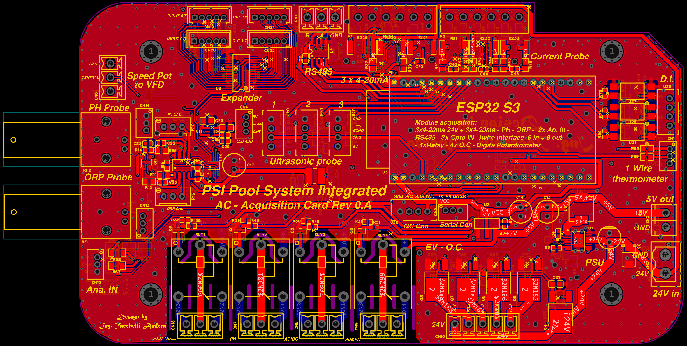
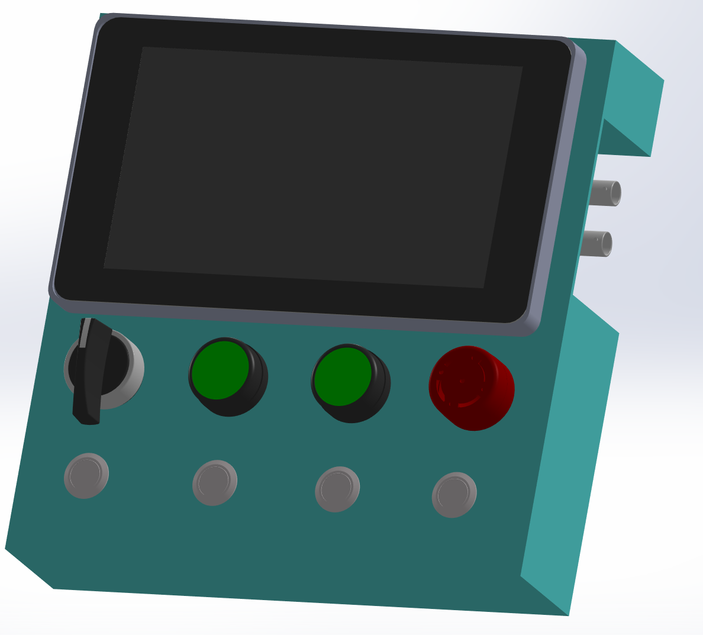
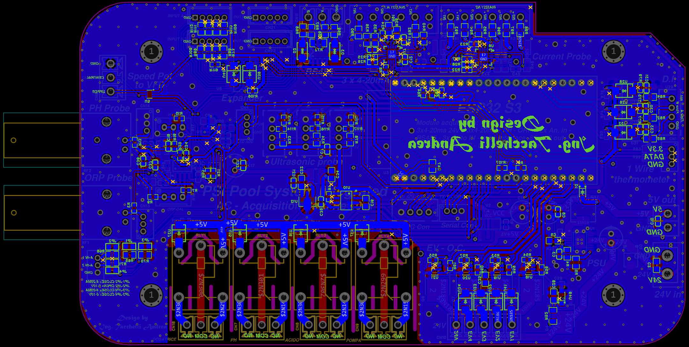
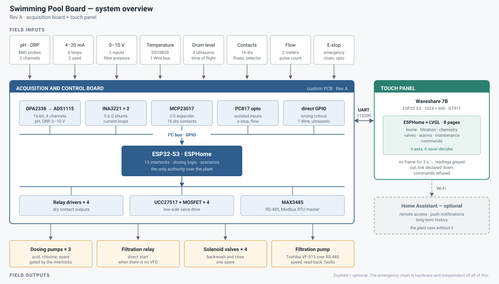

# Swimming Pool System Open

**Un cervello open hardware per la piscina: misura l'acqua, dosa i prodotti chimici, comanda la pompa e tiene tutto in sicurezza.**

*[English](README.md)* · Rev A · progettato da Ing. Andrea Tacchelli

## In parole semplici

L'acqua di una piscina va tenuta in un intervallo stretto: né troppo acida né
troppo basica, con abbastanza cloro per restare pulita ma non così tanto da dare
fastidio. A mano significa strisce reattive, secchi e tentativi. Questa scheda lo
fa in automatico.

- **Misura** pH, cloro (ORP), temperatura dell'acqua, pressione del filtro,
  portata e quanto prodotto è rimasto nei fusti.
- **Agisce**: comanda le pompe dosatrici, la pompa di filtrazione (anche tramite
  un inverter a velocità variabile) e le valvole di cascata, getti e
  nebulizzatori.
- **Protegge**: prima di aggiungere qualsiasi prodotto controlla 13 condizioni
  (pompa in marcia, acqua che scorre davvero, sonde concordi, fusto non vuoto, …).
  Se una manca, non dosa. Se si preme il fungo di emergenza hardware, tutto si
  ferma, qualunque cosa stia facendo il software.
- **Si controlla** da un touch screen da 7" sul quadro, oppure da telefono o Home
  Assistant se lo desideri. L'impianto funziona anche senza rete.

È stata progettata, costruita e fatta funzionare su una piscina vera. Questo
repository contiene tutto per capirla, costruirla e migliorarla: schema, PCB,
distinta componenti, firmware e documentazione.

## L'hardware

| Lato superiore | Lato inferiore |
|---|---|
|  |  |

Scheda a due strati costruita attorno a un ESP32-S3. Sulla serigrafia c'è il suo
nome, "PSI Pool System Integrated, Acquisition Card Rev 0.A": è questa Rev A.

| | |
|---|---|
| **Misura** | pH e ORP (due sonde ciascuno per il controllo incrociato), pressione, temperatura (DS18B20), portata (2 contatori a impulsi), livello fusti (ultrasuoni + galleggianti), 6 anelli 4-20 mA industriali, 16 contatti puliti |
| **Comanda** | 4 relè (3 pompe dosatrici + filtrazione), 4 elettrovalvole, un collegamento RS-485 Modbus verso un inverter Toshiba VF-S15 |
| **Decide** | ESP32-S3 con ESPHome: 13 consensi al dosaggio, dosaggio manuale a impulsi con durata massima, sequenza di controlavaggio, stato sicuro all'accensione |
| **Mostra** | pannello touch Waveshare ESP32-S3 da 7", 8 pagine, collegato con un cavo seriale a 3 fili |
| **Comunica** | API nativa ESPHome (Home Assistant facoltativo) |

Scheda tecnica: [docs/datasheet.it.md](docs/datasheet.it.md) · [cablaggio (bozza)](docs/wiring.it.md) · [casi d'uso](docs/use-cases.it.md)

Dettagli: [mappa dei pin](docs/pin-map.it.md) · [ingressi e uscite](docs/io-map.it.md) ·
[protocollo del pannello](docs/uart-protocol.it.md) · [file hardware](hardware/README.it.md)

## Stato

La Rev A è la prima release pubblica. Funziona su una piscina vera, con i limiti
noti elencati in [docs/limitations.it.md](docs/limitations.it.md). È un progetto
di livello amatoriale condiviso per studio, feedback e uso non commerciale, e
**non** è certificato per alcuno schema normativo. Leggi l'[avviso di
sicurezza](#avviso-di-sicurezza).

## Aiutaci a migliorarlo

Il progetto è pubblico perché vogliamo i tuoi occhi su di esso. Non serve essere
ingegneri: proprietari di piscine, installatori, maker e semplici curiosi sono
tutti benvenuti.

- **Guarda la scheda** e dicci cosa ne pensi: il layout, la scelta dei
  componenti, qualsiasi cosa ti sembri strana o semplificabile.
- **Raccontaci come la useresti**: cosa vorresti misurare o comandare in
  piscina, in giardino o nel locale tecnico? Cosa manca?
- **Segnala errori** nello schema, nella distinta, nel firmware o nella
  documentazione: apri una **Issue**.
- **Condividi idee e domande** nelle **Discussions**. Le [idee per la prossima
  revisione](#dove-potrebbe-andare-prossima-revisione) sono un buon punto di
  partenza: dicci quali ti interessano.
- **Costruiscine una** e raccontaci com'è andata. Le foto sono molto gradite.
- **Vuoi parlare di lavoro?** Produzione, rivendita, integrazione o una versione
  su misura: usa la categoria *Commercial* nelle Discussions, oppure vedi
  [Contatti](#contatti).

Vedi [CONTRIBUTING.md](CONTRIBUTING.md) per segnalare bene i problemi.

## Per iniziare

1. **Hardware**: ordina il PCB dai [file Gerber](hardware/fabrication/gerber.zip)
   e procurati i componenti da [`hardware/bom.csv`](hardware/bom.csv).
2. **Firmware**: segui [`firmware/README.it.md`](firmware/README.it.md): copia
   `secrets.yaml.example`, regola i valori in cima a `spb-control.yaml`, poi
   `esphome run` su entrambe le schede.
3. **Prima accensione**: segui la [checklist di prima accensione](docs/bring-up.it.md)
   prima di collegare qualsiasi pompa o valvola.

## Guida al montaggio

*Prossimamente.* Una guida passo passo per popolare la scheda, cablare il quadro
e metterlo in servizio su una piscina, con foto. Una prima [bozza del cablaggio](docs/wiring.it.md)
è già disponibile.

## Dove potrebbe andare: prossima revisione

Sono idee per la Rev B, non promesse. Il tuo feedback decide l'ordine.

**Hardware**
- Un **orologio con batteria tampone**, così i timer funzionano anche senza rete.
- **Uscite analogiche** (per esempio 0-10 V o 4-20 mA per comandare altre
  apparecchiature).
- **Una seconda porta RS-485**, per più dispositivi sul bus.
- **Protezione dalle sovratensioni su ogni linea** in uscita dal quadro (ingressi
  sonde, relè, valvole), non solo l'ingresso 24 V e la coppia RS-485.
- **Isolamento galvanico** degli ingressi di campo e un riferimento più pulito
  per la sonda pH quando una cella di elettrolisi condivide l'acqua.
- Meno moduli innestati: un **ESP32-S3 integrato**, montaggio più semplice e
  costo più basso.
- Rivedere quali connettori e relè servono davvero e rendere le etichette
  inequivocabili.

**Firmware e pannello**
- Mostrare **quale allarme** è scattato, non solo quanti.
- Una **procedura guidata di calibrazione** sul touch per pH e ORP.
- Leggere **più sensori di temperatura** (per esempio la cella di elettrolisi).
- **Scelta della lingua** e display con doppio buffer per uno schermo più fluido.
- **Dashboard Home Assistant** pronte e notifiche.
- Timer settimanali per gli scenari di filtrazione (richiedono l'orologio con
  batteria).

**Documentazione**
- La guida al montaggio, una guida al cablaggio per connettore e un breve video.
- Una guida alla messa in servizio per gli installatori.

## Avviso di sicurezza

Questa scheda comanda pompe dosatrici per acido e cloro, elettrovalvole e una
pompa di filtrazione. Un guasto o un errore di cablaggio o di configurazione può
rilasciare prodotti chimici o far funzionare le apparecchiature a secco.

- La **catena di emergenza è hardware** e indipendente dal firmware. I tredici
  consensi al dosaggio nel firmware sono una comodità, non il sistema di
  sicurezza. Realizza una vera catena di sicurezza hardware.
- Tutte le uscite partono spente e il dosaggio manuale è sempre un impulso a
  tempo limitato. Queste protezioni non sostituiscono la catena di emergenza.
- Il cablaggio in tensione di rete deve essere eseguito da una persona
  qualificata, in un contenitore adatto e con le protezioni appropriate.
- Il progetto è fornito senza alcuna garanzia e lo usi a tuo rischio.

## Struttura del repository

| Cartella | Contenuto |
|---|---|
| [`hardware/`](hardware/README.it.md) | progetto EasyEDA Pro, file Gerber, schema, disegno di montaggio, BOM, immagini del layout, render del contenitore |
| [`firmware/`](firmware/README.it.md) | configurazione ESPHome di entrambe le schede e simulatore Python della scheda di controllo |
| [`docs/`](docs/) | mappa dei pin, mappa I/O, protocollo UART, limiti, checklist di prima accensione |

Ogni documento esiste in inglese e in italiano (`*.it.md`).

## Contatti

Progettato da **Ing. Andrea Tacchelli**. Progetto elettronica su misura e
firmware embedded (ESP32, ESPHome, automazione industriale e domotica). Se questo
lavoro ti piace e hai un progetto, un'idea di prodotto o una versione su misura in
mente, contattami: [github.com/ingTacchelli](https://github.com/ingTacchelli)
oppure una Discussion in questo repository.

## Licenza

Distribuito con licenza [Creative Commons Attribuzione-NonCommerciale-Condividi
allo stesso modo 4.0 Internazionale (CC BY-NC-SA 4.0)](https://creativecommons.org/licenses/by-nc-sa/4.0/).
Vedi [LICENSE](LICENSE). L'uso commerciale non è coperto da questa licenza:
contattami per parlarne.
