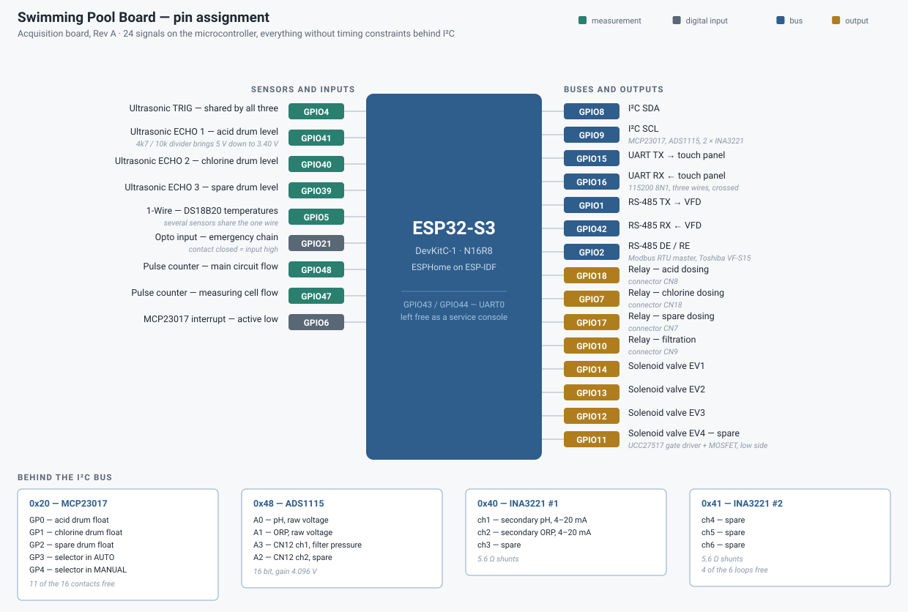

# Pin map

*[Italiano](pin-map.it.md)*

The rule behind this allocation: a signal stays on a microcontroller pin only
if it has a timing constraint the processor must meet in person. Everything
else — contacts, analog readings, current loops — goes behind the I²C bus,
where adding a channel costs a connector and not a pin.

That leaves 24 signals on the ESP32-S3, with UART0 completely free as a service
console.

## Microcontroller

| Pin | Direction | Function | Notes |
|---|---|---|---|
| GPIO1 | out | RS-485 TX | to the inverter |
| GPIO2 | out | RS-485 DE / RE | transmit enable |
| GPIO4 | out | Ultrasonic TRIG | shared by the three sensors |
| GPIO5 | bidir | 1-Wire | DS18B20 temperature bus |
| GPIO6 | in | MCP23017 interrupt | active low, INTA and INTB ORed |
| GPIO7 | out | Relay — chlorine dosing | connector CN18 |
| GPIO8 | bidir | I²C SDA | |
| GPIO9 | out | I²C SCL | |
| GPIO10 | out | Relay — filtration | connector CN9 |
| GPIO11 | out | Solenoid valve EV4 | spare |
| GPIO12 | out | Solenoid valve EV3 | |
| GPIO13 | out | Solenoid valve EV2 | |
| GPIO14 | out | Solenoid valve EV1 | |
| GPIO15 | out | UART TX | to the panel |
| GPIO16 | in | UART RX | from the panel |
| GPIO17 | out | Relay — spare dosing | connector CN7 |
| GPIO18 | out | Relay — acid dosing | connector CN8 |
| GPIO21 | in | Opto-coupled input | emergency chain; contact closed = input high |
| GPIO39 | in | Ultrasonic ECHO 3 | spare drum |
| GPIO40 | in | Ultrasonic ECHO 2 | chlorine drum |
| GPIO41 | in | Ultrasonic ECHO 1 | acid drum |
| GPIO42 | in | RS-485 RX | from the inverter |
| GPIO47 | in | Pulse counter | measuring-cell flow |
| GPIO48 | in | Pulse counter | main-circuit flow |
| GPIO43 / GPIO44 | — | UART0 | left free, service console |

Free pins: GPIO3, 35, 36, 37, 38, 46.

Four details to know before copying this pin map.

**Relay connectors.** The firmware maps the dosing relays by connector
designator: CN8 = acid, CN18 = chlorine, CN7 = spare, CN9 = filtration.
Check that the text printed next to each connector on your PCB agrees with this
table before wiring a pump (see the [bring-up checklist](bring-up.md)).

**ECHO pins.** The ultrasonic ECHO lines are named IN1, IN2 and IN3 on the
schematic, from an earlier plan in which they were generic digital inputs. The
firmware uses them as echo returns. The sensors are 5 V parts, so every echo
line sits behind a 4.7 kΩ / 10 kΩ divider that brings the level to 3.40 V.

**GPIO48** drives the RGB status LED on revision 1.0 DevKitC-1 boards. Here it
counts flow pulses, which is fine as an input, but that LED is not usable.

**GPIO2** holds the transmit enable of the RS-485 transceiver. Between
power-up and the moment the firmware takes the pin, the MAX3485 sits wherever
its pull resistor puts it: check on your board that this is the receive state
(R63 must be a pull-down to ground) before trusting the bus at boot.

## I²C bus

Five devices (MCP23017, ADS1115, two INA3221 and an MCP4018 digital
potentiometer), 100 kHz, on GPIO8 and GPIO9.

| Address | Device | Use |
|---|---|---|
| 0x20 | MCP23017 | 16 dry-contact inputs, 5 used |
| 0x2F | MCP4018 | digital potentiometer, VFD speed reference (CN6) |
| 0x48 | ADS1115 | 4 analog channels, 16 bit, 4.096 V full scale |
| 0x40 | INA3221 #1 | current loops 1 to 3 |
| 0x41 | INA3221 #2 | current loops 4 to 6 |

The MCP4018 is fitted on the board but the firmware does not use it.

### MCP23017 — 0x20

| Pin | Signal |
|---|---|
| GP0 | Minimum float, acid drum |
| GP1 | Minimum float, chlorine drum |
| GP2 | Minimum float, spare drum |
| GP3 | Selector in AUTO |
| GP4 | Selector in MANUAL |

The inputs are pulled up on the board and read inverted, so a contact closed to
ground means "product present" or "selector in this position". With no position
asserted the selector is at ZERO: the firmware derives that third state instead
of wiring a third contact. The floats are filtered at 500 ms, the selector at
100 ms.

The other eleven pins come out on connectors CN19 to CN22 and are free. The
4.7 kΩ pull-ups on the board are on the eight GPA inputs: check the schematic
before using GPB inputs.

### ADS1115 — 0x48

| Channel | Signal |
|---|---|
| A0 | pH, raw voltage from the OPA2338 front end |
| A1 | ORP, raw voltage |
| A2 | CN12 channel 2 — spare, exposed as raw voltage |
| A3 | CN12 channel 1 — filter pressure, 0-10 V |

Both CN12 channels go through a 0.4005 divider, and each has jumpers that turn
it into a 4-20 mA input on a 205 Ω load, if you prefer a current loop there.

The ADS1115 is powered at 5 V while the bus is at 3.3 V, which is slightly below
the 0.7 × VDD input-high level it requires. If you see erratic readings or NAKs
on the bus, look here first.

### INA3221 — 0x40 and 0x41

Six 4-20 mA inputs on 5.6 Ω shunts. Two are used, for the secondary pH and ORP
transmitters; the other four are free.

## Touch panel

The panel is a stock Waveshare ESP32-S3-Touch-LCD-7B. One connector matters for
this project: the **H3** header, which brings out UART0.

| H3 pin | Signal | Panel GPIO |
|---|---|---|
| 1 | 3V3 output | — leave free |
| 2 | GND | — |
| 3 | EX_RXD | GPIO44 |
| 4 | EX_TXD | GPIO43 |

GPIO15 and GPIO16 on the panel are *not* available: the Waveshare schematic
assigns them to the SP3485 RS-485 transceiver and they never come out as TTL.
UART0 reaches H3 only if switch **SW1** is on H3 and not on the on-board CH343P
USB-serial bridge.

The panel's I²C header on GPIO8 and GPIO9 and its micro-SD socket (MOSI GPIO11,
SCK GPIO12, MISO GPIO13, chip select on the CH32V003 expander) are not used by
this firmware and remain available.
