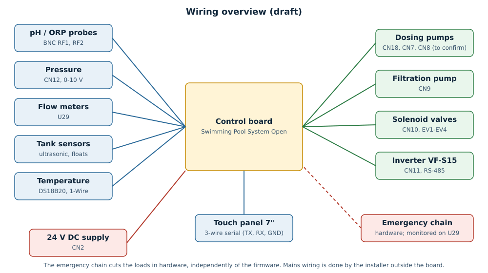

# Cablaggio (bozza)

*[English](wiring.md)*

**Bozza.** Questa pagina elenca ciò che è certo oggi e indica ciò che va ancora
confermato sulla scheda reale. Non cablare le pompe da qui finché le voci *Da
confermare* non sono chiuse.

## Principi

- **La rete resta fuori dalla scheda.** I relè sono contatti puliti: l'alimentazione
  di pompe e valvole passa attraverso di essi, cablata dall'installatore, in un
  contenitore adatto e con le sue protezioni.
- **La catena di emergenza hardware** (selettore, pulsanti, fungo) interrompe i
  carichi indipendentemente dal firmware. La scheda la *monitora* soltanto.
- **Un cavo, uno scopo:** sonde con cavo schermato lontano dal cablaggio di relè e
  pompe; BNC per pH e ORP.

## Connettori

| Connettore | Serigrafia | Funzione | Stato |
|---|---|---|---|
| CN2 | ALIMENTAZIONE | ingresso 24 V DC | confermato |
| CN18 | DOSATRICE | relè, pompa dosatrice cloro | confermato |
| CN9 | FILTRAGGIO | relè, pompa di filtrazione | confermato |
| CN7 | ACIDO | relè, **vedi l'avviso sotto** | **da confermare** |
| CN8 | PH | relè, **vedi l'avviso sotto** | **da confermare** |
| CN10 | ELETTROVALVOLE | elettrovalvole EV1-EV4 (5 poli: quattro uscite e il comune) | confermato, piedinatura da documentare |
| CN11 | RS485A | RS-485 verso l'inverter | confermato, piedinatura da documentare |
| CN6 | vfd pot | riferimento di velocità (potenziometro digitale, non usato dal firmware) | confermato |
| CN12 | | ingresso analogico 0-10 V, pressione | confermato |
| CN19-CN22 | PH-5A | 16 ingressi a contatto pulito | confermato; funzione per connettore da documentare |
| RF1, RF2 | | BNC: sonde pH e ORP | confermato |
| U29 | | monitor catena di emergenza (pin 1), portata B (pin 2), portata A (pin 3) | confermato |
| CN1, CN5, CN13, CN14, CN3, CN4, U30, U38, U46, U47 | | sensori a ultrasuoni, 1-Wire, portata, uscita LED, collegamento pannello e altri | **da documentare** |

## Avviso: connettori dei relè CN7 e CN8

Il firmware comanda la pompa dell'acido da CN8 e l'uscita di dosaggio di riserva
da CN7. Il testo di serigrafia accanto ai connettori dice il contrario (CN7
"ACIDO", CN8 "PH"). Finché non è verificato sulla scheda reale, **non collegare
una pompa di acido o di cloro**. Verifica con un tester che GPIO18 comandi il
relè che intendi usare per l'acido, poi cambia i pin in
`firmware/control/packages/control-outputs.yaml` oppure annota qui la correzione.

## Da fare per la versione definitiva

- Tabelle di piedinatura per connettore con colori dei fili e cavo consigliato.
- Uno schema di cablaggio di un quadro completo, con la catena di emergenza.
- Sezione dei cavi e fusibili consigliati per ogni carico.
